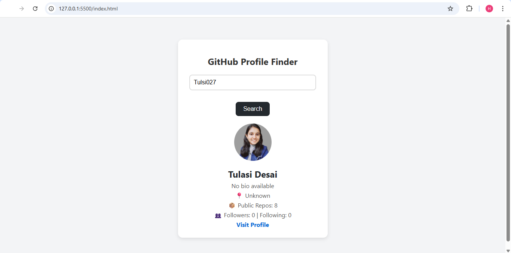

# 🔍 GitHub Profile Fetcher

A simple and elegant web app that allows users to fetch and display public GitHub profile information by entering a GitHub username. This project uses the **GitHub Users API** and basic DOM manipulation to provide real-time data from the internet.

---

## 🚀 Project Goal

The goal of this project is to:
- Learn how to **fetch data from public APIs** using `fetch()`.
- Understand **asynchronous JavaScript** and `async/await`.
- Practice **DOM manipulation** to dynamically update UI.
- Implement user input validation and error handling.

---

## 🛠️ Features

- 🔎 Enter a GitHub username to fetch their public profile.
- 🖼️ Displays avatar, name, bio, location, repo count, followers, and a link to profile.
- ⚠️ Shows error message if the user is not found or input is empty.
 
---

## 💡 What I Learned

- How to use the **Fetch API** to make GET requests.
- Working with **JSON data** returned from an external API.
- Building **interactive UIs** with input, buttons, and dynamic DOM updates.
- Writing cleaner **JavaScript using `async/await`**.
- Handling edge cases and providing proper **user feedback**.

---

## 🔗 GitHub API Used

- [GitHub Users API](https://api.github.com/users/{username})

---

## 📷 Demo Screenshot

---
 
 
## 📚 License

This project is open for learning purposes. Feel free to use, modify, or extend it. 🚀
